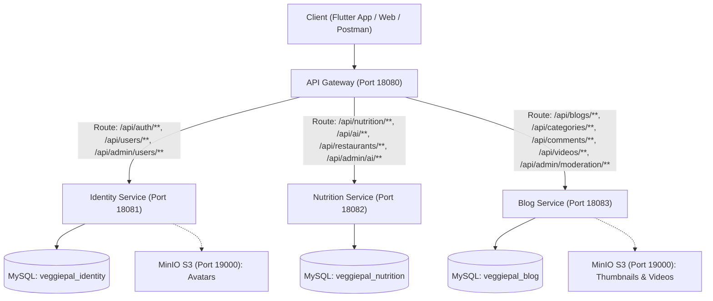

# VeggiePal Backend - Architecture & Requirements Traceability Matrix (RTM)

## 1. Tổng Quan Kiến Trúc (Architecture Overview)

VeggiePal là hệ sinh thái nền tảng số hỗ trợ lối sống thuần chay (100% Vegan), được thiết kế theo kiến trúc **Microservices** hướng dịch vụ trên nền tảng Java 21, Spring Boot 4.1.1, MySQL 8.4, MinIO và Spring Cloud Gateway.

### Danh Sách Cổng (Port Mapping)
- **API Gateway**: `18080` (Tích hợp Swagger UI tổng hợp tại `/swagger-ui.html`)
- **Identity Service**: `18081`
- **Nutrition Service**: `18082`
- **Blog Service**: `18083`
- **MySQL Database**: `3307` (Host port, kết nối tới container `veggiepal-mysql`)
- **MinIO Storage**: `19000` (API), `19001` (Web Console)

---

## 2. Bảng Truy Vết Yêu Cầu Chức Năng (Requirements Traceability Matrix - RTM)

| Mã Yêu Cầu | Tên Yêu Cầu Chức Năng | Microservice Đảm Nhiệm | API Endpoints | Entities & Tables Liên Quan | Quy Tắc Nghiệp Vụ (BR) & Ghi Chú |
|:---|:---|:---|:---|:---|:---|
| **FR-01** | Xác thực & Quản lý tài khoản người dùng | `identity-service` | `POST /auth/register` `POST /auth/token` `POST /auth/introspect` `POST /auth/logout` `GET /users/me` `PUT /users/me` | `User` (`users`) | Mã hóa mật khẩu BCrypt, JWT Bearer Token, kiểm tra tài khoản bị khóa (`BLOCKED`/`INACTIVE`). |
| **FR-02** | Khách vãng lai truy cập & Dùng thử AI Chatbot | `nutrition-service` `blog-service` | `POST /ai/chat/guest` `GET /blogs` `GET /restaurants` | `GuestAiUsage` (`guest_ai_usage`) | Header `X-Guest-Id`. Giới hạn dùng thử đúng **3 câu hỏi**. Câu thứ 4 trả về HTTP 429 (`GUEST_AI_QUOTA_EXCEEDED`). |
| **FR-03** | Quản lý bài viết cộng đồng thuần chay | `blog-service` | `POST /blogs` `GET /blogs/me` `GET /blogs` `GET /blogs/{id}` `PUT /blogs/{id}` `DELETE /blogs/{id}` | `Blog` (`blogs`) | Người dùng sở hữu nội dung; hỗ trợ upload ảnh bìa (MinIO S3); tìm kiếm theo từ khóa và phân loại danh mục. |
| **FR-04** | Tương tác bài viết: Bình luận & Bỏ phiếu (Vote) | `blog-service` | `POST /comments` `GET /comments` `POST /comments/{id}/replies` `POST /blogs/{id}/vote` `DELETE /blogs/{id}/vote` | `Comment` (`comments`) `ContentVote` (`content_votes`) | Bình luận đa cấp (hỗ trợ phân trang và reply); Vote giá trị `1` (thích) hoặc `-1` (bỏ thích); bấm 2 lần tự động hủy vote. |
| **FR-05** | Tìm kiếm & Đề xuất nội dung liên quan | `blog-service` `nutrition-service` | `GET /blogs?keyword=...` `GET /blogs/{id}/related` `GET /nutrition/recipes?keyword=...` `GET /videos?keyword=...` | `Blog`, `Recipe`, `Video` | Tìm kiếm bài viết theo từ khóa tiêu đề/nội dung, đề xuất 5 bài cùng danh mục, tìm kiếm công thức thuần chay. |
| **FR-06** | Tạo thực đơn thuần chay 7 ngày bằng AI | `nutrition-service` | `POST /nutrition/meal-plans/generate` `POST /nutrition/meal-plans` `GET /nutrition/meal-plans` `GET /nutrition/meal-plans/{id}` `POST /nutrition/meal-plans/{id}/replace-meal` | `MealPlan` (`meal_plans`) `Recipe` (`recipes`) `UserIngredient` (`user_ingredients`) | Thuật toán AI Rule-Based loại trừ nghiêm ngặt các chất dị ứng của người dùng (`UserAllergy`), ưu tiên nguyên liệu có sẵn trong tủ, tính calo theo mục tiêu sức khỏe (Giảm cân, Tăng cơ, Duy trì). |
| **FR-07** | Trợ lý ảo AI Chatbot tư vấn dinh dưỡng chay | `nutrition-service` | `POST /ai/chat` `GET /ai/chat/conversations` `GET /ai/chat/conversations/{id}` | `ChatConversation` (`chat_conversations`) `ChatMessage` (`chat_messages`) | Mô hình Demo Provider cục bộ nhận diện thông minh các chủ đề: thiếu chất B12, công thức món ăn, calo thực vật, duy trì bối cảnh hội thoại. |
| **FR-08** | Video hướng dẫn nấu ăn & Tóm tắt bằng AI | `blog-service` | `POST /videos` `GET /videos` `GET /videos/{id}` `GET /videos/me` `POST /videos/{id}/summarize` | `Video` (`videos`) | Hỗ trợ lưu trữ thông tin video nấu ăn; module AI trích xuất tự động: Tóm tắt món, Nguyên liệu cốt lõi, Các bước nấu ăn và Điểm sáng dinh dưỡng. |
| **FR-09** | Tìm kiếm nhà hàng chay gần đây (Haversine) | `nutrition-service` | `GET /restaurants/nearby` `GET /restaurants/{id}` | `Restaurant` (`restaurants`) | Tính khoảng cách thực tế giữa GPS người dùng và nhà hàng bằng công thức Haversine; lọc theo bán kính `radiusKm` và sắp xếp theo độ tương thích món ăn. |
| **FR-10** | Quản trị hệ thống & Giám sát vận hành AI | `identity-service` `nutrition-service` | `GET /admin/users` `PUT /admin/users/{id}/status` `GET /admin/ai/logs` `GET /admin/ai/metrics` | `AiOperationLog` (`ai_operation_logs`) `User` | Quyền `ADMIN` kiểm tra danh sách tài khoản, kích hoạt/khóa người dùng vi phạm; theo dõi nhật ký hoạt động AI, thời gian phản hồi trung bình (latency) và tỷ lệ thành công. |
| **FR-11** | Quản lý danh mục bài viết & món ăn | `blog-service` | `GET /categories` `GET /categories/{id}` `POST /categories` `PUT /categories/{id}` `DELETE /categories/{id}` | `Category` (`categories`) | Cây danh mục 2 cấp (`FOOD_TYPE`, `RECIPE_TYPE`). Cho phép Admin thêm/sửa/ẩn danh mục; bảo đảm tính toàn vẹn khi có bài viết đang sử dụng. |
| **FR-12** | Kiểm duyệt nội dung tự động & Hàng đợi Admin | `blog-service` | `GET /admin/moderation/queue` `GET /admin/moderation/{id}` `POST /admin/moderation/{id}/review` | `ModerationCase` (`moderation_cases`) | Kiểm duyệt từ khóa tự động: từ ngữ thô tục/xúc phạm -> `REJECTED`; từ khóa chứa thịt/hải sản không thuần chay -> chuyển `PENDING` vào hàng đợi Admin để duyệt thủ công. |

---

## 3. Các Quy Tắc Nghiệp Vụ Cốt Lõi (Business Rules - BR)

1. **BR-01 (Bảo mật & Phân quyền)**:
   - Các API quản trị (`/admin/**`) yêu cầu token có claim `role: "ADMIN"`.
   - Mật khẩu người dùng được băm an toàn bằng thuật toán BCrypt.
2. **BR-02 (Kiểm duyệt nội dung trước khi công khai)**:
   - Mọi bài viết cộng đồng và video khi xuất bản đều phải đi qua bộ lọc kiểm duyệt.
   - Nội dung vi phạm tiêu chuẩn cộng đồng bị từ chối hoặc chuyển vào hàng đợi kiểm duyệt để quản trị viên đánh giá.
3. **BR-03 (Hạn ngạch dùng thử cho khách vãng lai)**:
   - Khách vãng lai (`Guest`) được dùng thử miễn phí 3 lượt chat AI với định danh `X-Guest-Id`. Sau 3 lượt, hệ thống từ chối và hướng dẫn đăng ký tài khoản.
4. **BR-04 (Cấu trúc phân cấp danh mục)**:
   - Cây danh mục giới hạn tối đa 2 cấp độ nhằm đảm bảo trải nghiệm người dùng tinh gọn, không phân nhánh quá sâu.
5. **BR-05 (An toàn dữ liệu - Không xóa cứng tài nguyên quan trọng)**:
   - Khi Admin gỡ bài viết vi phạm của người dùng, trạng thái được chuyển sang `BANNED` (ẩn khỏi cộng đồng nhưng giữ nguyên dữ liệu kiểm toán).
6. **BR-06 (Chuẩn mực 100% Thuần Chay - Vegan Integrity)**:
   - Danh mục dị ứng không bao gồm các nhóm có nguồn gốc động vật (thịt, cá, sữa bò, trứng) vì toàn bộ nền tảng mặc định 100% thuần chay.
   - Bộ lọc kiểm duyệt tự động phát hiện và cảnh báo các từ khóa chứa thành phần động vật.
7. **BR-07 (Quyền sở hữu tài nguyên)**:
   - Người dùng chỉ có quyền chỉnh sửa hoặc xóa bài viết, bình luận, video, tủ nguyên liệu do chính mình tạo ra.
